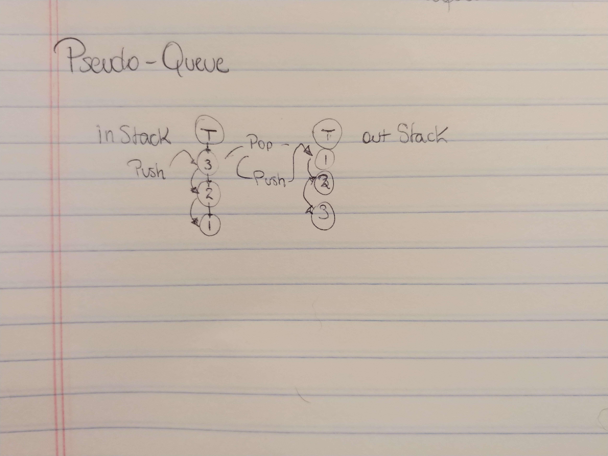

# Queues with Stacks
Implement a Queue class that can enqueue and dequeue on a FIFO order using two stacks. 

## Challenge
Since stacks are FILO I have to figure out a way to use the methods we already wrote to flip the order the values are saved so when you dequeue the first value out is the first received. 

## Approach & Efficiency
Since we have two stacks I can use one of the stacks to receive all of the value we need to work with then pop them and push then into the second stack that way I've effectively reverse the order. I can use peek to iterate through the stack as long as I test for the stack being empty.

## API

